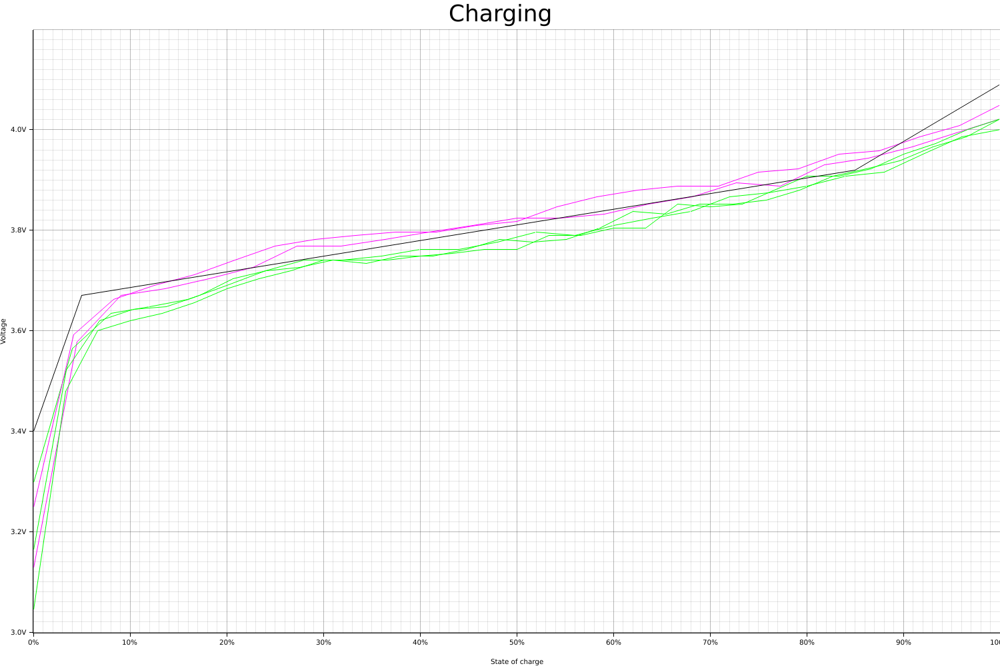
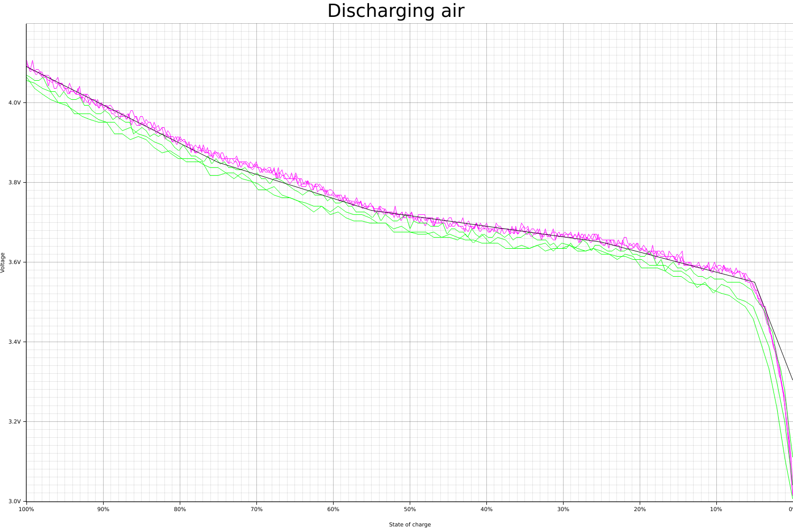
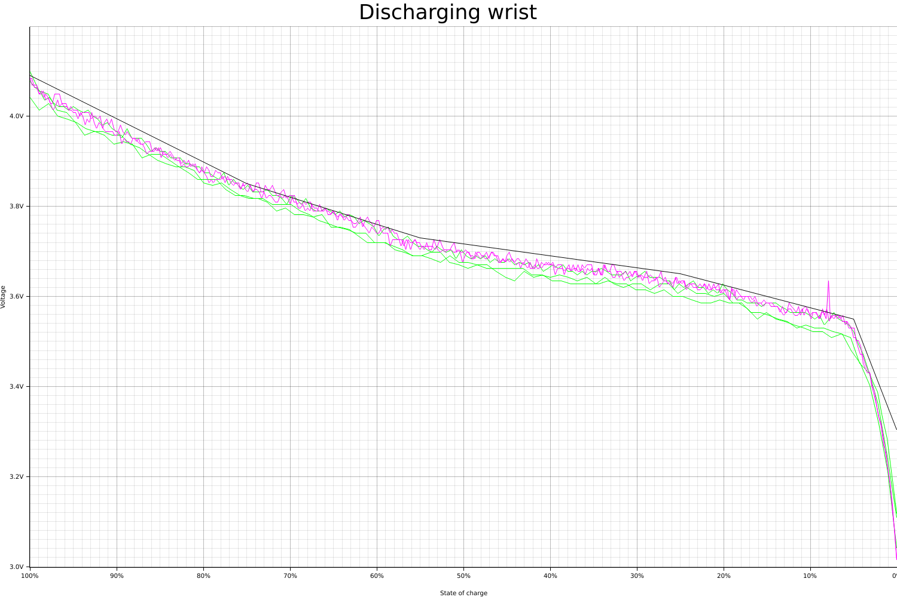

<!--
SPDX-License-Identifier: CC-BY-SA-4.0
Copyright (C) 2020 Casper Meijn <casper@meijn.net>

This work is licensed under the Creative Commons Attribution-ShareAlike 4.0 International License. 
To view a copy of this license, visit http://creativecommons.org/licenses/by-sa/4.0/ or 
  send a letter to Creative Commons, PO Box 1866, Mountain View, CA 94042, USA.
-->

# Battery measurement

This sub-project measure the voltage of the Pinetime battery while charging or discharging.

The goal is to create a function to convert the measured voltage to a state-of-charge (percentage). This is achieved by 
measureing the voltage over time. The assumption is that the power usage is constant, therefore the percentage of 
runtime is the battery percentage. So plotting the voltage over time, create a voltage to state-of-charge graph.

Two other battery parameters are recorded as well:
- Temperature, the temperature of the battery could influence the voltage. So a watch on the wrist could have a 
    different graph then a wrist on a table.
- Charging state, while charging the voltage is higher and more constant because of the charger.

This results in three different graphs.

## Charging



## Discharging to air



## Discharging on wrist



## Measuring new data

A PineTime smartwatch with Klok firmware will automatically collect battery voltage while running. For the best result,
you need to charge or discharge full cycles. So discharge until the smartwatch turns off, then charge for multiple 
hours. The data will persist across reboots.

Collecting data is done via bluetooth with mcumgr on the terminal. For example:
```
cd ~/src/klok/battery_measurement/data
mcumgr -c pinetime log show battery 0 --all > filename.txt
```

The data then needs some processing. Mainly the files need to be split so that only data points of the same type are in 
one file.

## Generating graphs
```
cd ~/src/klok/battery_measurement
cargo run
```
